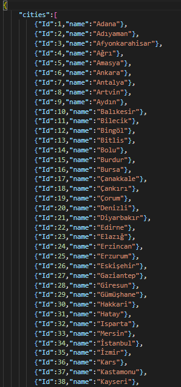

# Türkiye Şehir ve İlçeleri JSON Dosyası
---
## 81 il ve 922 ilçe İçişleri Bakanlığı verilerine göre hazırlanmıştır
##### JSON içerisinde "cities" ile şehirlerin bulunduğu obje dizisine ulaşabilirsiniz.
###### Her bir şehir objesi "Id" ve "name" alanlarına sahiptir. Id plaka, name şehir ismini tutmaktadır.

##### İlçeler ise "districts" obje dizisinde tutulmaktadır.
###### Her bir ilçe objesi "cityId" ve "name" alanları sahiptir. cityId bulunduğu şehrin plakası, name ise ilçe ismini tutmaktadır.

### JSON dosyasına ait örnek görsel aşağıdaki gibidir

### LICENSE
[MIT](https://choosealicense.com/licenses/mit/)